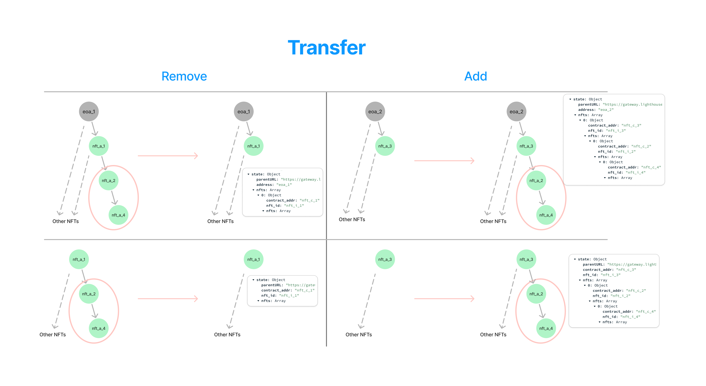

# NFT Tree Structure Storage

This is an express &amp; mongodb rest api project for bounding nfts for EOAs

## Configurations

#### ENV and Database

In the first step, add `.env` file similar to `.env.example` provided in the root of the project:

```shell
PORT=5001
CONNECTION_STRING=mongodb+srv://<user>:<password>@<cluster>.1rsunpv.mongodb.net/<collection>?retryWrites=true&w=majority

GREENFIELD_GATEWAY = "https://gnfd-testnet-sp2.bnbchain.org/view/"
GREENFIELD_NFT_IMAGE_BUCKET = "zerox-nft-image/"
GREENFIELD_NFT_METADATA_BUCKET = "zerox-nft-metadata/"
GREENFIELD_NFT_STATE_BUCKET = "zerox-nft-state/"

ACCOUNT_ADDRESS='0x...'
ACCOUNT_PRIVATEKEY='0x...' # should start with 0x
```

In order to fill `CONNECTION_STRING` inside your `.env` file, you need to create your cluster and collection in [MongoDB](https://account.mongodb.com/account/login).

> Note: for testing the app you can use
>
> -   Thunder Client (VSCode extension) or Postman
> -   MongoDB (VSCode extension)

#### Packages

Simply just run the following commands in the root of the project:

```shell
npm install
pnpm install
```

## Run

To run in dev mode (using `nodemon`):

```shell
npm run dev
```

To start the project (using `node`):

```shell
npm run start
```

## APIs and Routes

You can see the main routes in `server.js` and the following routes in `routes` folder.

For more information, see the Swagger API documentations at: http://localhost:5001/api-docs/

## Example

This is a simple example you can start with, however, using the api docs, you can check all the functionalities.

| HTTP Method | API                                                                 | Body                                                                                                | Purpose                                                                     |
| ----------- | ------------------------------------------------------------------- | --------------------------------------------------------------------------------------------------- | --------------------------------------------------------------------------- |
| POST        | http://localhost:5001/api/eoa                                       | { address: "eoa_1" }                                                                                | Create EOA                                                                  |
| POST        | http://localhost:5001/api/eoa                                       | { address: "eoa_2" }                                                                                | Create EOA                                                                  |
| GET         | http://localhost:5001/api/eoa / http://localhost:5001/api/eoa/eoa_1 |                                                                                                     | Get EOAs/EOA alongside their tree structure                                 |
| POST        | http://localhost:5001/api/nft/mint                                  | { <br /> "contract_addr": "nft_c_1", <br /> "nft_id": "nft_i_1", <br/> "data_url": "nft_d_1" <br/>} | Create NFT (**metadata** and **metadata_url** are optional body parameters) |
| PUT         | http://localhost:5001/api/tba/nft_c_1/nft_i_1                       | { "address": "nft_a_1" }                                                                            | TBA for NFT                                                                 |
| PUT         | http://localhost:5001/api/nft/transfer/nft_c_1/nft_i_1              | { <br/> "from": "0", <br/> "to": "eoa_1" <br/>}                                                     | Transfer NFT                                                                |
| POST        | http://localhost:5001/api/nft/mint                                  | { <br /> "contract_addr": "nft_c_2", <br /> "nft_id": "nft_i_2", <br/> "data_url": "nft_d_2" <br/>} | Create NFT (**metadata** and **metadata_url** are optional body parameters) |
| PUT         | http://localhost:5001/api/tba/nft_c_2/nft_i_2                       | { "address": "nft_a_2" }                                                                            | TBA for NFT                                                                 |
| PUT         | http://localhost:5001/api/nft/transfer/nft_c_2/nft_i_2              | { <br/> "from": "0", <br/> "to": "nft_a_1" <br/>}                                                   | Transfer NFT                                                                |
| POST        | http://localhost:5001/api/nft/mint                                  | { <br /> "contract_addr": "nft_c_3", <br /> "nft_id": "nft_i_3", <br/> "data_url": "nft_d_3" <br/>} | Create NFT (**metadata** and **metadata_url** are optional body parameters) |
| PUT         | http://localhost:5001/api/tba/nft_c_3/nft_i_3                       | { "address": "nft_a_3" }                                                                            | TBA for NFT                                                                 |
| PUT         | http://localhost:5001/api/nft/transfer/nft_c_3/nft_i_3              | { <br/> "from": "0", <br/> "to": "nft_a_2" <br/>}                                                   | Transfer NFT                                                                |
| POST        | http://localhost:5001/api/nft/mint                                  | { <br /> "contract_addr": "nft_c_4", <br /> "nft_id": "nft_i_4", <br/> "data_url": "nft_d_4" <br/>} | Create NFT (**metadata** and **metadata_url** are optional body parameters) |
| PUT         | http://localhost:5001/api/tba/nft_c_4/nft_i_4                       | { "address": "nft_a_4" }                                                                            | TBA for NFT                                                                 |
| PUT         | http://localhost:5001/api/nft/transfer/nft_c_4/nft_i_4              | { <br/> "from": "0", <br/> "to": "nft_a_2" <br/>}                                                   | Transfer NFT                                                                |
| PUT         | http://localhost:5001/api/nft/transfer/nft_c_3/nft_i_3              | { <br/> "from": "eoa_1", <br/> "to": "eoa_2" <br/>}                                                 | Transfer NFT                                                                |
| \* PUT      | http://localhost:5001/api/nft/transfer/nft_c_2/nft_i_2              | { <br/> "from": "eoa_1", <br/> "to": "nft_a_3" <br/>}                                               | Transfer NFT                                                                |
| GET         | http://localhost:5001/api/tba/nft_a_1                               |                                                                                                     | Get NFT data alongside its tree structure                                   |

<!-- | GET | http://localhost:5001/api/tba/nft_a_1 | | Get NFT data alongside its tree structure | -->

\* The changes in this phase is also shown in the figure below:


